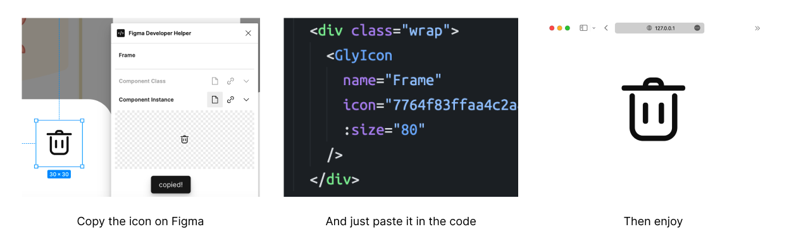
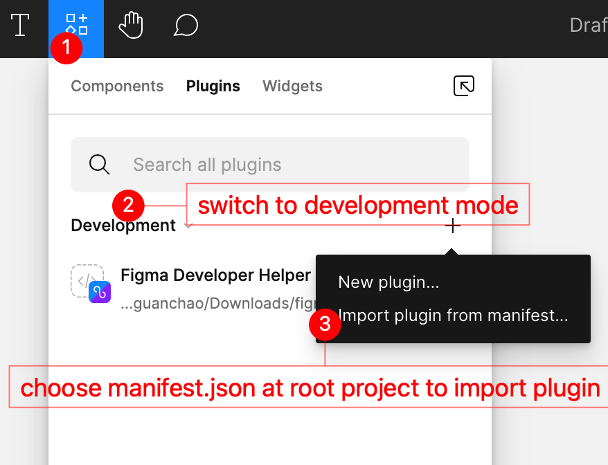

# Figma Developer Helper



This is a tool set for front-end developers to import icon resources. The goal of this project is to make icon resources easy to maintain and use, and to make the process of importing icon resources into the project more efficient, so that developers can focus on the development of business logic.

> This project only provide a poor doc, but I think it is enough for you to understand how it works. If you have any questions, please feel free to open an issue.

## Features

- Integrated with Ali OSS
- Support both Vue and React
- Based on SVG

## Concept

It is very common for front-end developers to use icon resources in their projects, and often use Figma to design prototypes. For icons, we usually export them and put them in the project, all this is done manually. This process is very inefficient and error-prone, and it is also difficult to maintain the icon resources in the project. This project is to solve this problem.

The idea is to export the icon resources and upload them to the OSS, and then generate a component code snippet, which can be directly copied and pasted into the project. And before building, the icon resources will be downloaded from the OSS and put into the project automatically.

> This project is only suitable for projects that use Vue or React, and use vite as the build tool. But it can be easily extended to other frameworks and build tools.

## Quick Start

### Download

Clone project to local.

```shell
git clone git@github.com:WayneWu98/figma-developer-helper.git

cd figma-developer-helper

npm i
```

### Configure

Duplicate `.env` to `.env.local` and fill 2 env vars:

```shell
OSS_ACCESS_KEY_ID=
OSS_ACCESS_KEY_SECRET=
```

### Build

```shell
npm run build
```

### Project Setup

You should provide the environment for the project to use this tool set.

```bash
# .env.development
VITE_APP_ICON_HOST=$OSS_ICON_HOST
# on dev, all icons is ref by network

# .env.production
VITE_APP_ICON_HOST=/__icons/
# on prod, all icons will be downloaded to project/public/__icons/, and ref by local
```

And then ignore the icon folder in `.gitignore`.

```bash
public/__icons/
```

#### Vue

1. copy `project/components/GlyIcon.vue` to your project and register it as a global component;
2. copy `project/vite-plugins/prune-gly-icon.ts` to your project and use it as a vite plugin (this plugin will remove unused but necessary attributes from the icon component code);
3. copy `project/build-scripts/fetch-icon-resources/vue` to your project, and add `vite-node path/to/script` as prebuild script in `package.json` (this script is for scanning which icons is used and download them from OSS into project).

#### React

1. copy `project/components/GlyIcon.tsx` and `project/components/GlyIcon.module.scss` to your project;
2. copy `project/vite-plugins/auto-import-gly-icon.ts` to your project and use it as a vite plugin (this plugin will import GlyIcon component in-demand);
3. copy `project/build-scripts/fetch-icon-resources/react` to your project, and add `vite-node path/to/script` as prebuild script in `package.json` (this script is for scanning which icons is used and download them from OSS into project).

### Preparation

Download Figma APP on [https://www.figma.com/downloads/](https://www.figma.com/downloads/)

Import plugin to Figma follow these steps below.



### Run

Run api server first.

```shell
npm run server.
```

And everything works.

### FYI

1. set alias `fds` to `cd [project-path] && npm run server`, and then you can just type `fds` to activate server.

## Q&A

### Why some icons are not downloaded?

This tool set will scan the project and find out which icons are used, and then download them from OSS. But if the icon is used in a dynamic way. For example, the icon key is passed in as a parameter. Then this tool set cannot find out which icons are used, so it cannot download them. You should specify the `key` explicitly. If you do have to use dynamic icon, you can just create a new file to store it.

For React:

```tsx
// just write theses comments near the icon code, and the tool will scan by regex
{/* <GlyIcon key="aaaa" /> */}
{/* <GlyIcon key="bbbb" /> */}
{/* <GlyIcon key="cccc" /> */}
```

For Vue:

```vue
<template>
  <!-- you should create a new sfc to write these, the tool will read it and parse to ast for detecting used icons -->
  <GlyIcon key="aaaa" />
  <GlyIcon key="bbbb" />
  <GlyIcon key="cccc" />
</template>
```

### How to replace icons as prototypes iterative upgrading?

As you can see in the Figma Plugin, we provide two ways to export icons: **Component Class** and **Component Instance**. When you use **Component Class**, a attribute named `FIGMA_KEY` will be added to the icon component. It is used to identify the icon. When prototype is upgraded, you can just find that one you want by FIGMA_KEY, and replace it with the new one, and keep the `FIGMA_KEY` unchanged.
